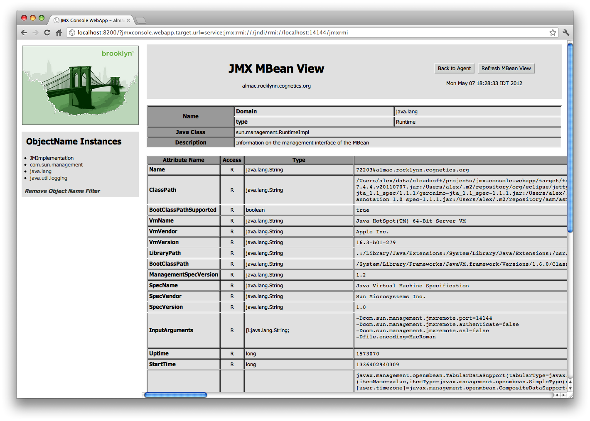

## JMX Console Webapp

Exposes access to a JMX endpoint (MBeanServer) through a webapp, ie a hosted jconsole that can be embedded anywhere.
Allows viewing, editting, etc.

Heavily based on code in JBoss 6 (but appears to be dropped in JBoss 7).  **Thanks Red Hat!**

## Usage Notes

To point it at a remote endpoint, add e.g.  jmxconsole.webapp.target.url=service:jmx:rmi:///jndi/rmi://10.0.0.1:10100/jmxrmi
to the http request (or a servlet attribute, or system property, then finally it will default to a same-jvm platform server).

]

## Wishlist

* Authenticated JMX support (SSL, user, and password) 
* Better rendering (eg arrays)
* Better "fromString" parsing (see eg brooklyn TypeCoercions) 
* Better property editors (cf JBoss 6 PropertyEditors) 
* User-level entitlements for visibility, invocation, etc
